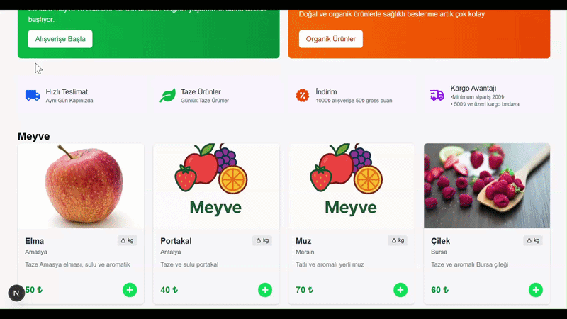

# 🍎 Groccery-Commerce: Full-Stack Manav Otomasyonu

Modern web teknolojileri ile geliştirilmiş, kullanıcı dostu bir manav alışveriş deneyimi sunan Full-Stack e-ticaret uygulamasıdır. Ürünlerin sepetlenmesinden, Stripe ile güvenli ödeme adımına kadar tüm süreçler uçtan uca simüle edilmiştir.

## 🚀 Öne Çıkan Özellikler
* **Dinamik Ürün Katalogu:** MongoDB üzerinden çekilen güncel ürün listesi.
* **Gelişmiş Sepet Sistemi:** Ürün ekleme, miktar güncelleme ve gerçek zamanlı toplam tutar hesaplama.
* **Stripe Ödeme Entegrasyonu:** Gerçek dünya standartlarında güvenli ödeme akışı.
* **Stok Yönetimi:** Ödeme sonrası otomatik stok düşürme ve veritabanı senkronizasyonu.
* **Modern Arayüz:** **Tailwind CSS 4** ile geliştirilmiş, tamamen responsive tasarım.
* **Hızlı Bildirimler:** **React-Toastify** ile kullanıcı etkileşimleri için anlık geri bildirimler.

## 🛠️ Teknoloji Stack'i
* **Framework:** Next.js 16 (App Router)
* **Frontend:** React 19, TypeScript
* **Styling:** Tailwind CSS 4
* **Database:** MongoDB & Mongoose
* **Payment:** Stripe API
* **Icons:** React Icons
* **Notifications:** React-Toastify

## ⚙️ Kurulum ve Çalıştırma

1.  **Projeyi Klonlayın:**
    ```bash
    git clone https://github.com/kullaniciadi/groccery-commerce.git
    cd groccery-commerce
    ```

2.  **Bağımlılıkları Yükleyin:**
    ```bash
    npm install
    ```

3.  **Environment Variables (.env) Ayarları:**
    Ana dizinde bir `.env.local` dosyası oluşturun ve gerekli anahtarları ekleyin:
    ```env
    MONGODB_URI=your_mongodb_connection_string
    STRIPE_SECRET_KEY=your_stripe_secret_key
    NEXT_PUBLIC_API_URL=http://localhost:3000
    ```

4.  **Uygulamayı Başlatın:**
    ```bash
    npm run dev
    ```

## 🎥 Demo



---
*Bu proje, modern web geliştirme pratiklerini sergilemek amacıyla hazırlanmış bir portfolyo çalışmasıdır.*
